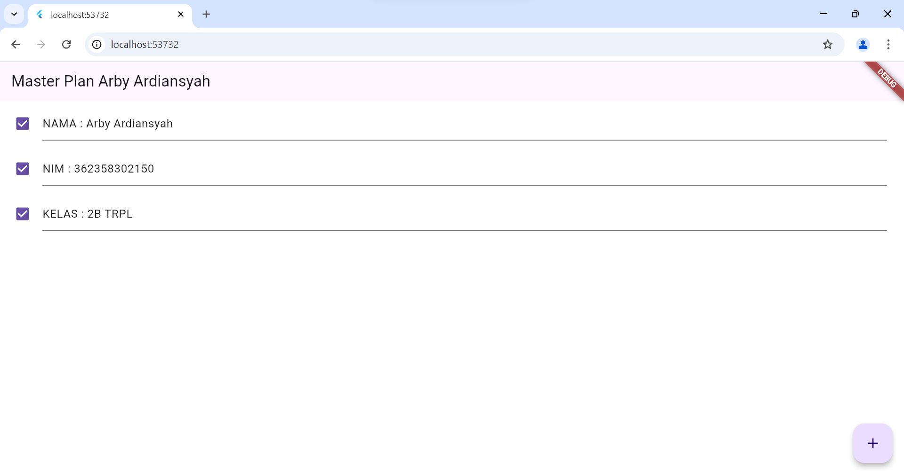

NAMA : MOH. ARBI ARDIANSYAH

NIM : 362358302150

KELAS : 2B TRPL

                                                                     PRAKTIKUM STATE

HASIL PRAKTIKUM :

TUGAS PRAKTIKUM :

Penjelasan Langkah 4 (data_layer.dart):

1. Langkah ini membuat file data_layer.dart yang berfungsi sebagai "entry point" untuk mengelola model data di aplikasi.
File data_layer.dart ini mengekspor file plan.dart dan task.dart, sehingga ketika aplikasi berkembang, Anda hanya perlu mengimpor data_layer.dart untuk mendapatkan akses ke semua model terkait.
Hal ini dilakukan untuk mengurangi redundansi dan meningkatkan modularitas kode, sehingga manajemen data menjadi lebih terstruktur dan mudah diatur saat menambah atau mengubah model lainnya.

2. Alasan Menggunakan Variabel plan dan Menetapkannya sebagai Konstanta:

Variabel plan pada langkah 6 merupakan instance dari Plan, digunakan untuk menyimpan dan memanipulasi daftar tasks yang ditambahkan oleh pengguna di aplikasi.
Menjadikannya const memastikan objek Plan memiliki nilai awal tetap saat diinisialisasi, yang berguna untuk membuat nilai default-nya konsisten. Namun, tasks tetap dapat dimodifikasi saat aplikasi berjalan melalui setState, memberikan kontrol atas pembaruan tanpa mengubah referensi objek.

3. Hasil Langkah 9 dalam Bentuk GIF dan Penjelasan:
 Di langkah ini, setiap task ditampilkan menggunakan ListTile yang berisi checkbox dan TextFormField untuk setiap task. Checkbox digunakan untuk menandai status complete, sedangkan TextFormField memungkinkan pengguna untuk mengedit deskripsi task. Hasil akhirnya, pengguna bisa dengan mudah menambah dan mengelola task.

4. Kegunaan Method pada Langkah 11 (initState) dan Langkah 13 (dispose) dalam Lifecycle State:

Langkah 11 (initState):
initState digunakan untuk menginisialisasi scrollController dan menambahkan Listener. Listener ini akan menghapus fokus dari TextFormField saat pengguna menggulir layar, memastikan keyboard tidak menghalangi tampilan ketika ada banyak task.
initState dijalankan sekali saat widget pertama kali dibuat, sehingga memastikan scrollController siap sebelum interaksi pengguna.
Langkah 13 (dispose):
dispose membersihkan scrollController ketika widget dihapus dari pohon widget. Ini menghindari kebocoran memori dengan memastikan semua resources yang terpakai oleh scrollController dilepas dengan benar.
dispose penting untuk menjaga performa aplikasi dengan memastikan hanya resources yang diperlukan yang dipertahankan selama widget masih digunakan.

